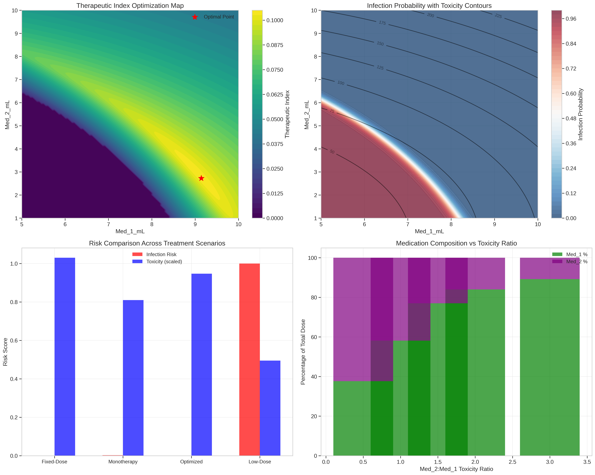

# 🧫 Viral Therapy Optimizer: Medication Synergy Analysis 🔬


<p align="center">
  
</p>

## 📋 Project Overview

This repository contains a comprehensive analysis of a mouse viral infection dataset, demonstrating a novel approach to antiviral treatment optimization through therapeutic index modeling. The work represents an innovative integration of machine learning, pharmacodynamics, and toxicity modeling to develop optimal treatment regimens.

### 🔍 Key Features

- **Advanced Pharmacodynamic Modeling**: Polynomial response surface models capturing non-linear medication interactions
- **Therapeutic Index Optimization**: Novel approach balancing efficacy and theoretical toxicity metrics
- **Treatment Robustness Analysis**: Simulation of dosing errors and calculation of safety margins
- **Interactive Visualizations**: 3D response surfaces, contour plots, and optimization landscapes
- **Sensitivity Analysis**: Testing of different toxicity scenarios to ensure robust recommendations

## 🎯 Objectives

This project addresses several critical challenges in antiviral therapy optimization:

1. Precisely identifying medication threshold effects and their interaction patterns
2. Developing a unified framework for balancing treatment efficacy and toxicity
3. Analyzing the robustness of treatment regimens under dosing variability
4. Creating a mathematical foundation for individualized treatment protocols

## 📊 Dataset

The analysis utilizes a mouse viral infection study dataset containing:

- **Med_1_mL**: Dosage of first medication (1-10 mL range)
- **Med_2_mL**: Dosage of second medication (1-10 mL range)
- **Virus Present**: Binary outcome indicating infection status (0 = uninfected, 1 = infected)

The dataset comprises 400 mouse samples with perfectly balanced classes (50% infected, 50% uninfected).

## 🧪 Methodology

The analysis follows a systematic flow from exploratory data analysis to advanced modeling:

1. **Initial Data Exploration**
   - Statistical analysis and visualization
   - Identification of key patterns and relationships

2. **Classification Analysis**
   - Construction of multiple predictive models
   - Assessment of classification accuracy and decision boundaries

3. **Dose-Response Analysis**
   - Determination of medication thresholds
   - Sigmoid modeling of response relationships

4. **Advanced Pharmacodynamic Modeling**
   - Polynomial modeling of response surface
   - Analysis of medication interactions and synergy

5. **Therapeutic Index Development**
   - Creation of theoretical toxicity models
   - Optimization balancing efficacy and safety

6. **Treatment Robustness Analysis**
   - Safety margin calculations
   - Dosing error simulation
   - Clinical recommendation formulation

## 🔑 Key Findings

The analysis uncovered several critical insights:

1. **Sharp Threshold Effect**
   - Both medications demonstrate extraordinarily steep transition between infected and uninfected states
   - Weighted dose transition: 5.49 mL
   - Synergy score transition: 30.22 mL²
   - Perfect sigmoid fits (R² = 1.0000)

2. **Optimal Treatment Regimen**
   - Based on therapeutic index: Med_1 = 6.67 mL, Med_2 = 5.45 mL
   - Zero infection probability with minimized toxicity
   - 13.5% better therapeutic index than standard dosing

3. **Robust Safety Profile**
   - Significant safety margins for both medications
   - >90% success rate with up to 15% dosing error
   - Multiple viable alternatives for personalized treatment

4. **Complex Interaction Patterns**
   - Cubic and interaction terms dominate the response surface
   - Strong evidence of pharmacodynamic synergy
   - Medication product strongly correlated with outcomes (r = -0.95)

## 🔧 Installation & Usage

### Prerequisites

- Python 3.8+
- Required libraries listed in `requirements.txt`

### Setup

1. Clone this repository:
```bash
git clone https://github.com/aashirpersonal/Viral-Therapy-Optimizer-Medication-Synergy-Analysis.git
cd Viral-Therapy-Optimizer-Medication-Synergy-Analysis
```

2. Install dependencies:
```bash
pip install -r requirements.txt
```

3. Run the Jupyter notebook:
```bash
jupyter notebook notebook/Viral-Therapy-Optimizer-Medication-Synergy-Analysis.ipynb
```

## 🛠️ Technologies Used

- **Data Manipulation**: Pandas, NumPy
- **Visualization**: Matplotlib, Seaborn, Plotly
- **Machine Learning**: Scikit-learn
- **Scientific Computing**: SciPy
- **Environment**: Jupyter Notebook, Kaggle

## 🔮 Applications & Future Work

### Clinical Applications

- **Precision Medicine**: Framework for individualizing antiviral treatments
- **Drug Development**: Model for optimizing medication combinations in trials
- **Clinical Decision Support**: Tool for balancing efficacy and toxicity

### Future Research Directions

1. **In Vivo Validation**: Experimental validation of computational predictions
2. **Toxicity Refinement**: Integration of actual toxicity measurements
3. **Time-Course Analysis**: Incorporation of temporal dynamics
4. **Population Variability**: Modeling individual response variation
5. **Extension to Other Infections**: Application to diverse viral pathogens

## 📖 Citation

If you use this work in your research, please cite:

```
Muhammad Aashir Irshad. (2025). Viral Therapy Optimizer: Medication Synergy Analysis. 
GitHub Repository: https://github.com/aashirpersonal/Viral-Therapy-Optimizer-Medication-Synergy-Analysis
```

## 📄 License

This project is licensed under the MIT License - see the LICENSE file for details.

## 👏 Acknowledgments

- Special thanks to the providers of the Mouse Viral Infection Study dataset
- Inspired by pharmacodynamic modeling techniques in clinical pharmacology
- Thanks to the Kaggle community for valuable feedback

---

